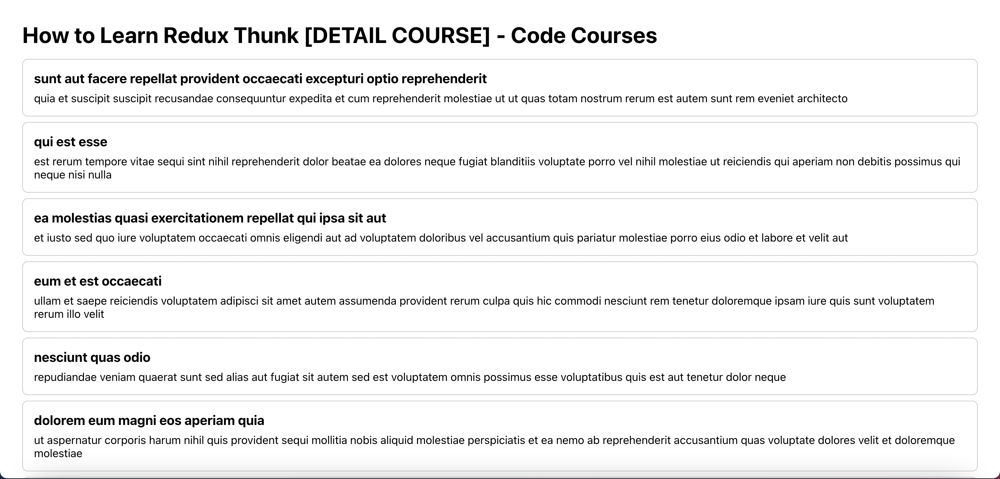

# How to Learn Redux [DETAIL COURSE]



## Table of Contents

| No. | Topics                                    |
| --- | ----------------------------------------- |
| 1   | [About Code Courses](#about-code-courses) |
| 2   | [Live Demo](#live-demo)                   |
| 3   | [Technologies](#technologies)             |
| 4   | [Running the demo](#running-the-demo)     |
| 5   | [Useful links](#useful-links)             |

<a id="about-code-courses"></a>

## 1. About Code Courses

[Code Courses](https://codecourses.site) is a website where people learn about coding and different technologies/frameworks/libraries. For the purpose of helping people learn, all of the courses are **FREE** and **DETAIL**. For this reason, Code Courses believe that you do not need to buy any courses out there. Hopefully, after following the content on Code Courses, you will find your dream jobs, and build any applications that you want.

<a id="live-demo"></a>

## 2. Live Demo

- For the full course, You can refer to this [link](https://codecourses.site/react/how-to-learn-redux-thunk-ep-1/).

- You can refer to this [Youtube video]() for the live demo.

<a id="technologies"></a>

## 3. Technologies

This demo uses:

- React.js.
- Redux ToolKit.
- React-Redux.

<a id="running-the-demo"></a>

## 4. Running the demo

Run the following command to install the app.

```sh
    npm install
    npm run start
```

Questions about running the demo? [Open an issue](https://github.com/codecourses-site/redux-thunk-course/issues). We're here to help ✌️

<a id="useful-links"></a>

## 5. Useful links

- 🔥 [Redux Toolkit](https://redux-toolkit.js.org/)
- 🔥 [Redux Thunk](https://github.com/reduxjs/redux-thunk)
- 🔷 [React.js](https://reactjs.org/)
